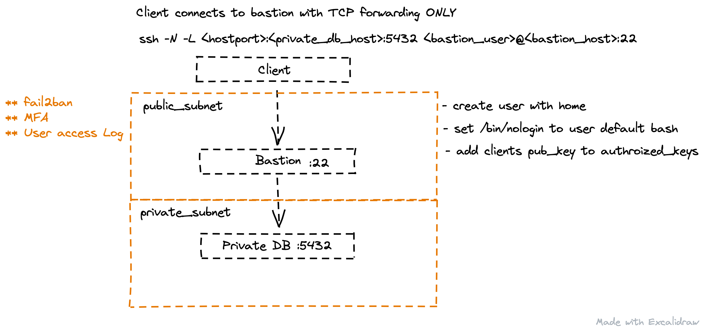

# Bastion box excercise

## AWS

<https://goteleport.com/blog/security-hardening-ssh-bastion-best-practices/>

<https://aws.amazon.com/blogs/security/how-to-record-ssh-sessions-established-through-a-bastion-host/>

<https://www.ssh.com/academy/ssh/sshd_config>

<https://aws.amazon.com/blogs/startups/securing-ssh-to-amazon-ec2-linux-hosts/>

## Manage User

- Create user without bash executions

`sudo useradd <username> -s=/bin/nologin -m`

- Client -N  Do not execute a remote command.  This is useful for just forwarding ports.

`ssh -N -L 5433:<db-host-private>:5432 alice@<bastion-host-public> -p 2222`

- Implement two-factor authentication

## Client ssh genkey consideration

<https://goteleport.com/blog/comparing-ssh-keys/>

`ssh-keygen -t ed25519 -C "unique name to identify this key."`

`ssh-keygen -l -f <key file>`
